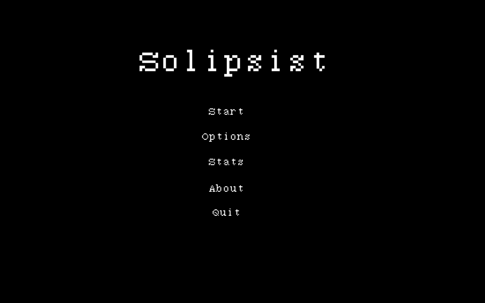
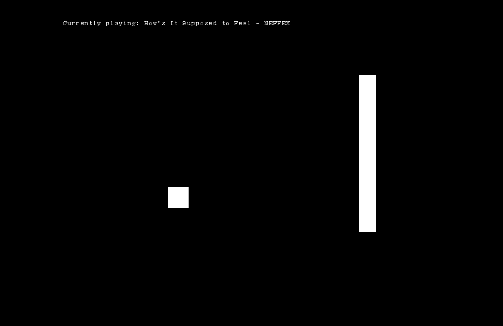

# Solipsist

This is a game where you need to control solipsist (Cube) that moves past obstacles.

## Installation

Install Python3
Install pip
###### run ``pip install -r requirements.txt`` in root directory
##### run ``python main.py`` in root directory 

## Contributing
Pull requests are welcome. For major changes, please open an issue first to discuss what you would like to change.

## License
[Apache License 2.0](http://www.apache.org/licenses/LICENSE-2.0)
